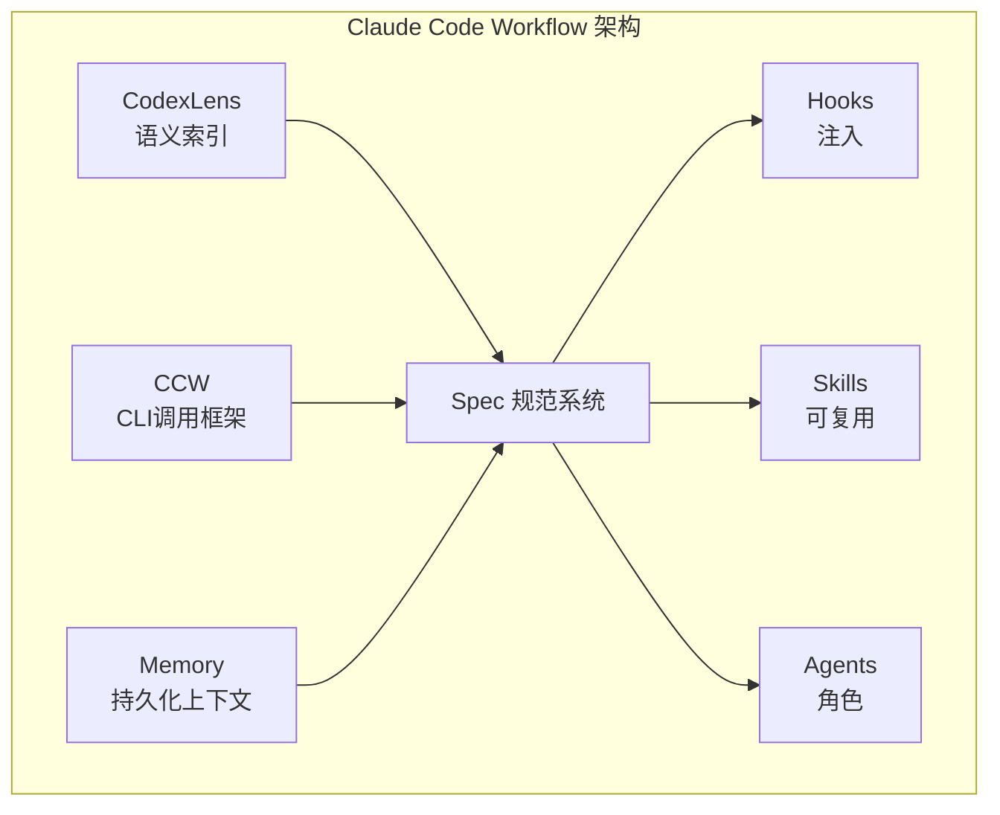

# Claude Code Workflow 是什么

## 一句话定位

**Claude Code Workflow 是 VS Code 的 AI 辅助开发工作台** — 通过语义代码索引、多模型 CLI 调用和团队协作系统，让 AI 深度理解项目并按规范生成高质量代码。

> AI 能力如藤蔓般生长 — Claude Code Workflow 是引导 AI 沿着您的项目架构、编码规范和团队工作流前行的支架。

---

## 1.1 解决的痛点

| 痛点 | 现状 | Claude Code Workflow 方案 |
|------|------|------------------|
| **AI 不理解项目** | 每次新会话都要重新解释项目背景、技术栈和编码规范 | Memory 系统持久化项目上下文，AI 跨会话记住项目知识 |
| **代码搜索困难** | 关键词搜索找不到语义相关代码，不知道函数在哪里被调用 | CodexLens 语义索引，支持自然语言搜索和调用链追踪 |
| **单模型局限** | 只能调用一个 AI 模型，不同模型擅长的场景不同 | CCW 统一调用框架，支持多模型协作（Gemini、Qwen、Codex、Claude） |
| **协作流程混乱** | 团队成员各自为战，代码风格不一致，规范难以落地 | 团队工作流系统（PlanEx、IterDev、Lifecycle）确保规范执行 |
| **规范难落地** | CLAUDE.md 写了但 AI 不遵守，项目约束被忽略 | Spec + Hook 自动注入，AI 强制遵循项目规范 |

---

## 1.2 vs 传统方式对比

| 维度 | 传统 AI 助手 | **Claude Code Workflow** |
|------|-------------|-----------------|
| **代码搜索** | 文本关键词搜索 | **语义向量搜索 + LSP 调用链** |
| **AI 调用** | 单一模型固定调用 | **多模型协作，按任务选择最优模型** |
| **项目记忆** | 每次会话重新解释 | **跨会话持久化 Memory** |
| **规范执行** | 依赖 Prompt 提醒 | **Spec + Hook 自动注入** |
| **团队协作** | 各自为战 | **结构化工作流系统** |
| **代码质量** | 取决于 AI 能力 | **多维度审查 + 自动修复循环** |

---

## 1.3 核心概念速览

| 概念 | 说明 | 位置/命令 |
|------|------|----------|
| **CodexLens** | 语义代码索引和搜索引擎 | `ccw search` |
| **CCW** | 统一 CLI 工具调用框架 | `ccw cli` |
| **Memory** | 跨会话知识持久化 | `ccw memory` |
| **Spec** | 项目规范和约束系统 | `.workflow/specs/` |
| **Hook** | 自动触发的上下文注入脚本 | `.claude/hooks/` |
| **Agent** | 专门角色的 AI 子进程 | `.claude/agents/` |
| **Skill** | 可复用的 AI 能力模块 | `.claude/skills/` |
| **Workflow** | 多阶段开发编排 | `/workflow:*` |

---

## 1.4 架构概览

---

## 下一步

- [快速开始](ch02-getting-started.md) — 安装和配置
- [核心概念](ch03-core-concepts.md) — 理解基础知识
- [工作流基础](ch04-workflow-basics.md) — 开始你的第一个工作流
