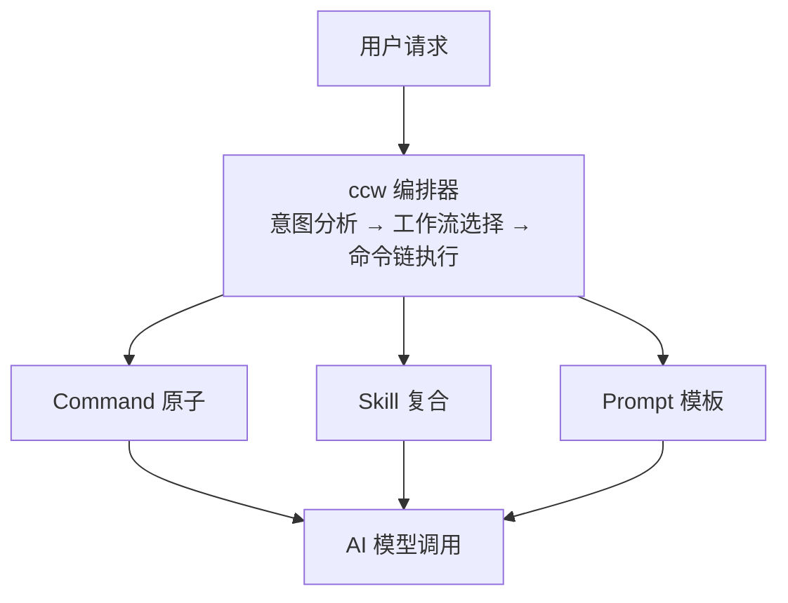
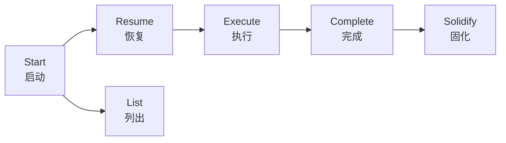
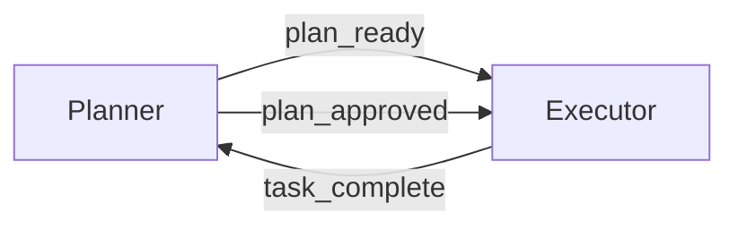
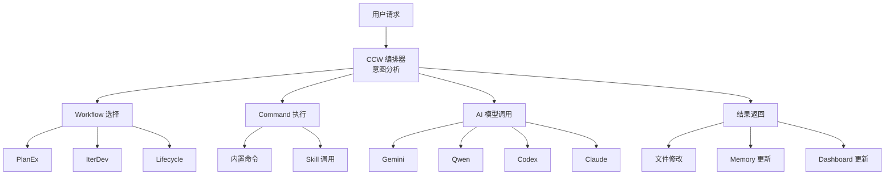

# 核心概念

## 一句话定位

**核心概念是理解 Claude_dms3 的基础** — Commands、Skills、Prompts 三层抽象，Workflow 会话管理，团队协作模式。

---

## 3.1 三层抽象

Claude_dms3 的命令系统分为三层抽象：

### 3.1.1 Commands - 内置命令

**Commands 是 Claude_dms3 的原子操作** — 预定义的可复用命令，完成特定任务。

| 类别 | 命令数量 | 说明 |
| --- | --- | --- |
| **核心编排** | 2 | ccw, ccw-coordinator |
| **CLI 工具** | 2 | cli-init, codex-review |
| **Issue 工作流** | 8 | discover, plan, execute, queue 等 |
| **Memory** | 2 | prepare, style-skill-memory |
| **Workflow 会话** | 6 | start, resume, list, complete 等 |
| **Workflow 分析** | 10+ | analyze, brainstorm, debug, refactor 等 |
| **Workflow UI 设计** | 9 | generate, import-from-code, style-extract 等 |

::: tip 提示
Commands 定义在 `.claude/commands/` 目录，每个命令是一个 Markdown 文件。
:::

### 3.1.2 Skills - 复合技能

**Skills 是 Commands 的组合封装** — 针对特定场景的可复用技能，包含多个步骤和最佳实践。

| Skill | 功能 | 触发方式 |
| --- | --- | --- |
| **brainstorm** | 多视角头脑风暴 | `/brainstorm` |
| **ccw-help** | CCW 命令帮助 | `/ccw-help` |
| **command-generator** | 生成 Claude 命令 | `/command-generator` |
| **issue-manage** | Issue 管理 | `/issue-manage` |
| **memory-capture** | Memory 压缩和捕获 | `/memory-capture` |
| **memory-manage** | Memory 更新 | `/memory-manage` |
| **review-code** | 多维度代码审查 | `/review-code` |
| **review-cycle** | 代码审查和修复循环 | `/review-cycle` |
| **skill-generator** | 生成 Claude 技能 | `/skill-generator` |
| **skill-tuning** | Skill 诊断和调优 | `/skill-tuning` |

::: tip 提示
Skills 定义在 `.claude/skills/` 目录，包含 SKILL.md 规范文件和参考文档。
:::

### 3.1.3 Prompts - Codex 提示

**Prompts 是 Codex 模型的指令模板** — 针对 Codex (GPT) 模型优化的提示模板。

| Prompt | 功能 |
| --- | --- |
| **prep-cycle** | Prep 周期提示 |
| **prep-plan** | Prep 规划提示 |

::: tip 提示
Codex Prompts 定义在 `.codex/prompts/` 目录，专为 Codex 模型优化。
:::

---

## 3.2 三层关系



### 3.2.1 调用路径

1. **用户发起请求** → 在 VS Code 中输入命令或描述需求
2. **ccw 编排** → 意图分析，选择合适的工作流
3. **执行 Command** → 执行原子命令操作
4. **调用 Skill** → 如需复杂逻辑，调用组合技能
5. **使用 Prompt** → 如需特定模型，使用优化提示
6. **AI 模型执行** → 调用配置的 AI 模型
7. **返回结果** → 格式化输出给用户

---

## 3.3 Workflow 会话管理

### 3.3.1 会话生命周期



### 3.3.2 会话命令

| 命令 | 功能 | 示例 |
| --- | --- | --- |
| **start** | 启动新会话 | `/workflow:session:start` |
| **resume** | 恢复已有会话 | `/workflow:session:resume <session-id>` |
| **list** | 列出所有会话 | `/workflow:session:list` |
| **sync** | 同步会话状态 | `/workflow:session:sync` |
| **complete** | 完成当前会话 | `/workflow:session:complete` |
| **solidify** | 固化会话成果 | `/workflow:session:solidify` |

### 3.3.3 会话目录结构

```
.workflow/
├── .team/
│   └── TC-<project>-<date>/      # 会话目录
│       ├── spec/                  # 会话规范
│       │   ├── discovery-context.json
│       │   └── requirements.md
│       ├── artifacts/             # 会话产物
│       ├── wisdom/                # 会话智慧
│       │   ├── learnings.md
│       │   ├── decisions.md
│       │   ├── conventions.md
│       │   └── issues.md
│       └── .team-msg/             # 消息总线
```

---

## 3.4 团队协作模式

### 3.4.1 角色系统

Claude_dms3 支持 8 种团队工作流，每种工作流定义了不同的角色：

| 工作流 | 角色 | 说明 |
| --- | --- | --- |
| **PlanEx** | planner, executor | 规划执行分离 |
| **IterDev** | developer, reviewer | 迭代开发 |
| **Lifecycle** | analyzer, developer, tester, reviewer | 生命周期覆盖 |
| **Issue** | discoverer, planner, executor | Issue 驱动 |
| **Testing** | tester, developer | 测试驱动 |
| **QA** | qa, developer | 质量保证 |
| **Brainstorm** | facilitator, perspectives | 多视角分析 |
| **UIDesign** | designer, developer | UI 设计生成 |

### 3.4.2 消息总线

团队成员通过消息总线通信：



### 3.4.3 工作流选择指南

| 任务目标 | 推荐工作流 | 命令 |
| --- | --- | --- |
| 新功能开发 | PlanEx | `/workflow-plan` |
| Bug 修复 | Lifecycle | `/debug-with-file` |
| 代码重构 | IterDev | `/refactor-cycle` |
| 技术决策 | Brainstorm | `/brainstorm-with-file` |
| UI 开发 | UIDesign | `/workflow:ui-design` |
| 集成测试 | Testing | `/integration-test-cycle` |
| 代码审查 | QA | `/review-cycle` |
| Issue 管理 | Issue | `/issue` 系列 |

---

## 3.5 核心概念速览

| 概念 | 说明 | 位置/命令 |
| --- | --- | --- |
| **Command** | 原子操作命令 | `.claude/commands/` |
| **Skill** | 复合技能封装 | `.claude/skills/` |
| **Prompt** | Codex 提示模板 | `.codex/prompts/` |
| **Workflow** | 团队协作流程 | `/workflow:*` |
| **Session** | 会话上下文管理 | `/workflow:session:*` |
| **Memory** | 跨会话知识持久化 | `ccw memory` |
| **Spec** | 项目规范约束 | `.workflow/specs/` |
| **CodexLens** | 语义代码索引 | `.codex-lens/` |
| **CCW** | CLI 调用框架 | `ccw` 目录 |

---

## 3.6 数据流



---

## 下一步

- [工作流基础](ch04-workflow-basics.md) — 学习使用各种工作流命令
- [高级技巧](ch05-advanced-tips.md) — CLI 工具链、多模型协作
- [最佳实践](ch06-best-practices.md) — 团队协作规范、代码审查流程
