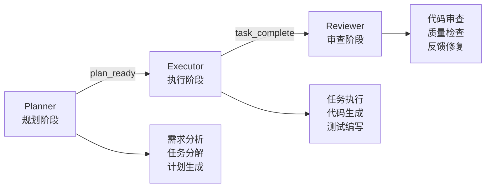
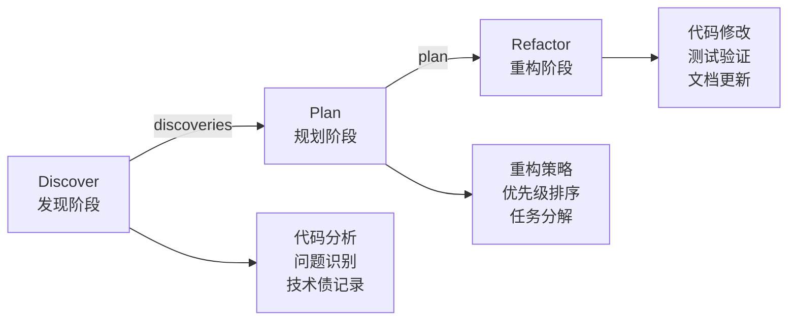
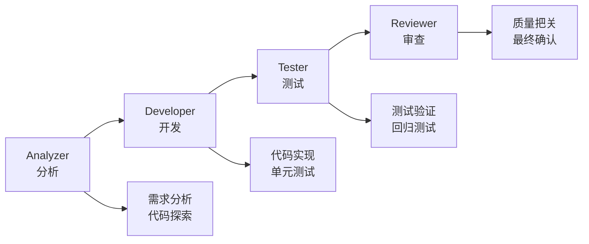
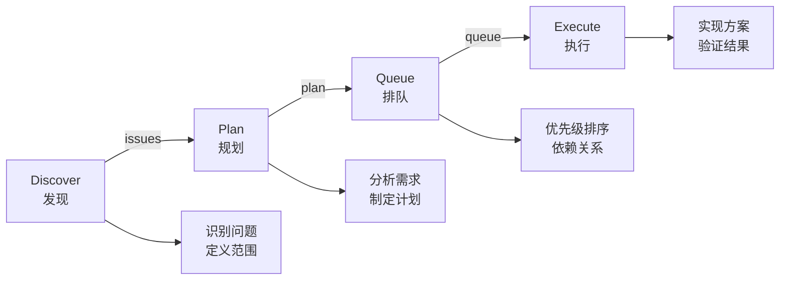
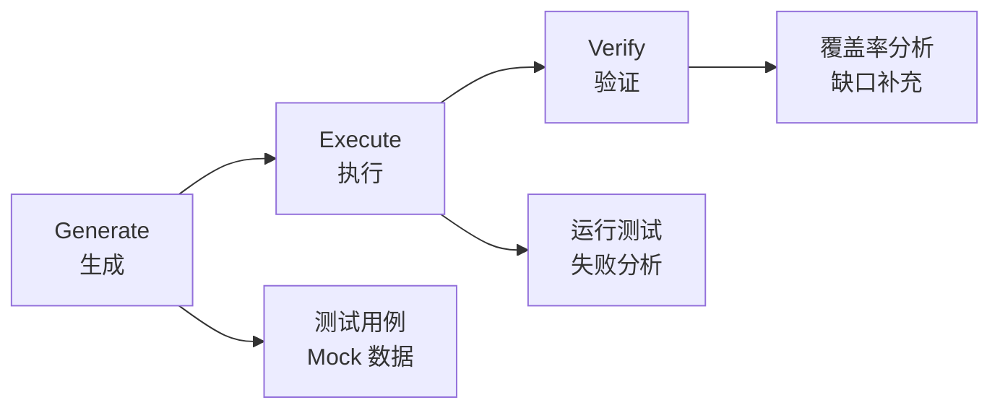

# 工作流基础

## 一句话定位

**工作流是团队协作的核心** — 8 种工作流覆盖开发全流程，从规划到执行，从分析到测试。

---

## 4.1 工作流概览

| 工作流 | 核心命令 | 适用场景 | 角色 |
| --- | --- | --- | --- |
| **PlanEx** | `/workflow:plan` | 新功能开发、需求实现 | planner, executor |
| **IterDev** | `/refactor-cycle` | 代码重构、技术债处理 | developer, reviewer |
| **Lifecycle** | `/unified-execute-with-file` | 完整开发周期 | analyzer, developer, tester, reviewer |
| **Issue** | `/issue:*` | Issue 驱动开发 | discoverer, planner, executor |
| **Testing** | `/integration-test-cycle` | 集成测试、测试生成 | tester, developer |
| **QA** | `/review-cycle` | 代码审查和质量保证 | qa, developer |
| **Brainstorm** | `/brainstorm-with-file` | 多视角分析、技术决策 | facilitator, perspectives |
| **UIDesign** | `/workflow:ui-design` | UI 设计和代码生成 | designer, developer |

---

## 4.2 PlanEx - 规划执行工作流

### 4.2.1 一句话定位

**PlanEx 是规划与执行分离的工作流** — 先规划再执行，确保任务清晰后再动手。

### 4.2.2 启动方式

```shell
/workflow:plan
```

或直接描述需求：

```plaintext
实现用户登录功能，支持邮箱和手机号登录
```

### 4.2.3 工作流程



### 4.2.4 输出产物

| 产物 | 位置 | 说明 |
| --- | --- | --- |
| **需求分析** | `artifacts/requirements.md` | 需求详细分析 |
| **任务计划** | `artifacts/plan.md` | 结构化任务列表 |
| **执行产物** | `artifacts/implementation/` | 代码和测试 |
| **智慧积累** | `wisdom/learnings.md` | 过程中学到的经验 |

---

## 4.3 IterDev - 迭代开发工作流

### 4.3.1 一句话定位

**IterDev 是迭代重构工作流** — 发现技术债、规划重构、迭代改进。

### 4.3.2 启动方式

```shell
/refactor-cycle
```

### 4.3.3 工作流程



### 4.3.4 使用场景

| 场景 | 示例 |
| --- | --- |
| **代码异味** | 函数过长、重复代码 |
| **架构改进** | 解耦合、模块化 |
| **性能优化** | 算法优化、缓存策略 |
| **安全加固** | 修复安全漏洞 |
| **规范统一** | 代码风格统一 |

---

## 4.4 Lifecycle - 生命周期工作流

### 4.4.1 一句话定位

**Lifecycle 是全生命周期覆盖工作流** — 从分析到测试到审查，完整闭环。

### 4.4.2 启动方式

```shell
/unified-execute-with-file <file>
```

### 4.4.3 角色职责

| 角色 | 职责 | 输出 |
| --- | --- | --- |
| **Analyzer** | 分析需求、探索代码 | 分析报告 |
| **Developer** | 实现功能、编写测试 | 代码 + 测试 |
| **Tester** | 运行测试、验证功能 | 测试报告 |
| **Reviewer** | 代码审查、质量检查 | 审查报告 |

### 4.4.4 工作流程



---

## 4.5 Issue - Issue 管理工作流

### 4.5.1 一句话定位

**Issue 是 Issue 驱动开发工作流** — 从 Issue 发现到规划到执行，完整追踪。

### 4.5.2 Issue 命令

| 命令 | 功能 | 示例 |
| --- | --- | --- |
| **discover** | 发现 Issue | `/issue discover https://github.com/xxx/issue/1` |
| **discover-by-prompt** | 从 Prompt 创建 | `/issue discover-by-prompt "登录失败"` |
| **from-brainstorm** | 从头脑风暴创建 | `/issue from-brainstorm` |
| **plan** | 批量规划 Issue | `/issue plan` |
| **queue** | 形成执行队列 | `/issue queue` |
| **execute** | 执行 Issue 队列 | `/issue execute` |

### 4.5.3 工作流程



---

## 4.6 Testing - 测试工作流

### 4.6.1 一句话定位

**Testing 是自迭代测试工作流** — 自动生成测试、迭代改进测试覆盖率。

### 4.6.2 启动方式

```shell
/integration-test-cycle
```

### 4.6.3 工作流程



---

## 4.7 QA - 质量保证工作流

### 4.7.1 一句话定位

**QA 是代码审查工作流** — 6 维度代码审查，自动发现问题。

### 4.7.2 启动方式

```shell
/review-cycle
```

### 4.7.3 审查维度

| 维度 | 检查项 |
| --- | --- |
| **正确性** | 逻辑正确、边界处理 |
| **性能** | 算法效率、资源使用 |
| **安全** | 注入漏洞、权限检查 |
| **可维护性** | 代码清晰、模块化 |
| **测试覆盖** | 单元测试、边界测试 |
| **规范符合** | 编码规范、项目约定 |

---

## 4.8 Brainstorm - 头脑风暴工作流

### 4.8.1 一句话定位

**Brainstorm 是多视角分析工作流** — 从多个视角分析问题，获得全面洞察。

### 4.8.2 启动方式

```shell
/brainstorm-with-file <file>
```

### 4.8.3 分析视角

| 视角 | 角色 | 聚焦 |
| --- | --- | --- |
| **Product** | 产品经理 | 市场契合、用户价值 |
| **Technical** | 技术负责人 | 可行性、技术债 |
| **Quality** | QA 负责人 | 完整性、可测试性 |
| **Risk** | 风险分析师 | 风险识别、依赖关系 |

### 4.8.4 输出格式

```markdown
## 一致结论
- [共识点 1]
- [共识点 2]

## 分歧点
- [分歧 1]
  - 视角 A: ...
  - 视角 B: ...
  - 建议: ...

## 行动项
- [ ] [行动项 1]
- [ ] [行动项 2]
```

---

## 4.9 UIDesign - UI 设计工作流

### 4.9.1 一句话定位

**UIDesign 是 UI 设计生成工作流** — 从设计稿到代码，自动提取样式和布局。

### 4.9.2 UI 设计命令

| 命令 | 功能 |
| --- | --- |
| **generate** | 生成 UI 组件 |
| **import-from-code** | 从代码导入样式 |
| **style-extract** | 提取样式规范 |
| **layout-extract** | 提取布局结构 |
| **imitate-auto** | 模仿参考页面 |
| **codify-style** | 样式代码化 |
| **design-sync** | 同步设计变更 |

---

## 4.10 快速参考

### 工作流选择指南

| 需求 | 推荐工作流 | 命令 |
| --- | --- | --- |
| 新功能开发 | PlanEx | `/workflow:plan` |
| 代码重构 | IterDev | `/refactor-cycle` |
| 完整开发 | Lifecycle | `/unified-execute-with-file` |
| Issue 管理 | Issue | `/issue:*` |
| 测试生成 | Testing | `/integration-test-cycle` |
| 代码审查 | QA | `/review-cycle` |
| 多视角分析 | Brainstorm | `/brainstorm-with-file` |
| UI 开发 | UIDesign | `/workflow:ui-design` |

### 会话管理命令

| 命令 | 功能 |
| --- | --- |
| `/workflow:session:start` | 启动新会话 |
| `/workflow:session:resume` | 恢复会话 |
| `/workflow:session:list` | 列出会话 |
| `/workflow:session:complete` | 完成会话 |
| `/workflow:session:solidify` | 固化成果 |

---

## 下一步

- [高级技巧](ch05-advanced-tips.md) — CLI 工具链、多模型协作
- [最佳实践](ch06-best-practices.md) — 团队协作规范、代码审查流程
