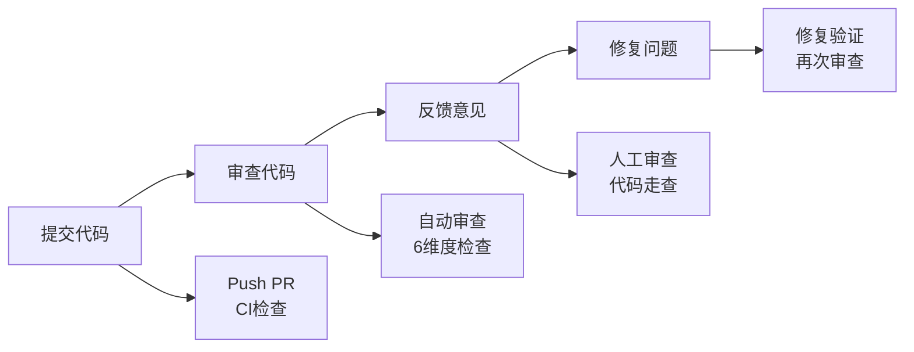

# 最佳实践

## 一句话定位

**最佳实践是团队高效协作的保障** — 规范制定、代码审查、文档维护、团队协作的实践经验总结。

---

## 6.1 团队协作规范

### 6.1.1 角色职责定义

| 角色 | 职责 | 技能要求 |
| --- | --- | --- |
| **Planner** | 需求分析、任务分解 | 架构思维、沟通能力 |
| **Developer** | 代码实现、单元测试 | 编码能力、测试意识 |
| **Reviewer** | 代码审查、质量把关 | 代码敏感度、规范理解 |
| **QA** | 质量保证、测试验证 | 测试设计、风险识别 |
| **Facilitator** | 协调沟通、进度跟踪 | 项目管理、冲突解决 |

### 6.1.2 工作流选择

| 场景 | 推荐工作流 | 理由 |
| --- | --- | --- |
| **新功能开发** | PlanEx | 规划与执行分离，降低风险 |
| **Bug 修复** | Lifecycle | 完整闭环，确保修复质量 |
| **代码重构** | IterDev | 迭代改进，持续优化 |
| **技术决策** | Brainstorm | 多视角分析，全面考虑 |
| **Issue 管理** | Issue | 可追溯，易管理 |
| **UI 开发** | UIDesign | 设计到代码无缝衔接 |

### 6.1.3 沟通协议

#### 消息格式

```
[<角色>] <操作> <对象>: <结果>

示例:
[Planner] 任务分解完成: 生成 5 个子任务
[Developer] 代码实现完成: user-auth.ts, 324 行
[Reviewer] 代码审查完成: 发现 2 个问题，建议 1 处优化
```

#### 状态报告

| 状态 | 含义 | 后续动作 |
| --- | --- | --- |
| **pending** | 待处理 | 等待依赖完成 |
| **in_progress** | 进行中 | 继续执行 |
| **completed** | 已完成 | 可以被依赖 |
| **blocked** | 被阻塞 | 需要人工介入 |

---

## 6.2 代码审查流程

### 6.2.1 审查维度

| 维度 | 检查项 | 严重性 |
| --- | --- | --- |
| **正确性** | 逻辑正确、边界处理 | HIGH |
| **性能** | 算法效率、资源使用 | MEDIUM |
| **安全** | 注入漏洞、权限检查 | HIGH |
| **可维护性** | 代码清晰、模块化 | MEDIUM |
| **测试覆盖** | 单元测试、边界测试 | MEDIUM |
| **规范符合** | 编码规范、项目约定 | LOW |

### 6.2.2 审查流程



### 6.2.3 审查清单

#### 代码正确性
- [ ] 逻辑正确，无 bug
- [ ] 边界条件处理
- [ ] 错误处理完整
- [ ] 资源释放正确

#### 性能
- [ ] 算法复杂度合理
- [ ] 无内存泄漏
- [ ] 无冗余计算
- [ ] 缓存策略合理

#### 安全
- [ ] 无 SQL 注入
- [ ] 无 XSS 漏洞
- [ ] 权限检查完整
- [ ] 敏感数据保护

#### 可维护性
- [ ] 命名清晰
- [ ] 模块化良好
- [ ] 注释充分
- [ ] 易于测试

#### 测试覆盖
- [ ] 单元测试完整
- [ ] 边界测试覆盖
- [ ] 异常情况测试
- [ ] 集成测试验证

#### 规范符合
- [ ] 编码风格统一
- [ ] 命名规范遵守
- [ ] 项目约定遵循
- [ ] 文档完整

### 6.2.4 反馈格式

```markdown
## 审查结果

### 问题
1. **[HIGH]** SQL 注入风险
   - 位置: `src/auth/login.ts:45`
   - 建议: 使用参数化查询

2. **[MEDIUM]** 性能问题
   - 位置: `src/utils/cache.ts:78`
   - 建议: 使用 LRU 缓存

### 建议
1. 命名优化: `data` → `userData`
2. 模块拆分: 建议将 Auth 逻辑独立

### 通过条件
- [ ] 修复 HIGH 问题
- [ ] 考虑 MEDIUM 建议
```

---

## 6.3 文档维护策略

### 6.3.1 文档分类

| 类型 | 位置 | 更新频率 | 负责人 |
| --- | --- | --- | --- |
| **规范文档** | `.workflow/specs/` | 按需 | 架构师 |
| **参考文档** | `docs/ref/` | 每次变更 | 开发者 |
| **指南文档** | `docs/guide/` | 每月 | 技术写手 |
| **API 文档** | `docs/api/` | 自动生成 | 工具 |
| **FAQ** | `docs/faq.md` | 每周 | 支持团队 |

### 6.3.2 文档更新触发

| 事件 | 更新内容 |
| --- | --- |
| **新增功能** | 添加功能文档和 API 参考 |
| **规范变更** | 更新规范文档和迁移指南 |
| **Bug 修复** | 更新 FAQ 和已知问题 |
| **架构变更** | 更新架构文档和决策记录 |
| **代码审查** | 补充缺失的注释和文档 |

### 6.3.3 文档质量标准

| 标准 | 要求 |
| --- | --- |
| **准确性** | 与实际代码一致 |
| **完整性** | 覆盖所有公开 API |
| **清晰性** | 易于理解，示例充分 |
| **时效性** | 及时更新，不滞后 |
| **可导航** | 结构清晰，易于查找 |

---

## 6.4 Memory 管理最佳实践

### 6.4.1 Memory 记录时机

| 时机 | 记录内容 |
| --- | --- |
| **架构决策** | 技术选型、设计决策 |
| **问题解决** | Bug 根因、解决方案 |
| **经验总结** | 最佳实践、避坑指南 |
| **规范约定** | 编码规范、命名约定 |
| **已知问题** | Bug、限制、TODO |

### 6.4.2 Memory 格式规范

```markdown
## [类型] 标题

### 背景
- **问题**: ...
- **影响**: ...
- **上下文**: ...

### 分析/决策
- **方案**: ...
- **理由**: ...
- **替代方案**: ...

### 结果
- **效果**: ...
- **数据**: ...

### 相关
- [相关记忆](memory-id)
- [相关代码](file-link)
- [相关文档](doc-link)
```

### 6.4.3 Memory 维护

| 维护项 | 频率 | 内容 |
| --- | --- | --- |
| **去重** | 每周 | 合并重复记忆 |
| **更新** | 按需 | 更新过时内容 |
| **归档** | 每月 | 归档历史记忆 |
| **清理** | 每季度 | 删除无用记忆 |

---

## 6.5 Hook 使用规范

### 6.5.1 Hook 类型

| Hook 类型 | 用途 | 示例 |
| --- | --- | --- |
| **pre-command** | 注入规范、加载上下文 | 自动加载 CLAUDE.md |
| **post-command** | 保存 Memory、更新索引 | 自动保存决策 |
| **pre-commit** | 代码审查、规范检查 | 自动运行 Lint |
| **file-change** | 自动格式化、更新索引 | 自动格式化代码 |

### 6.5.2 Hook 配置原则

| 原则 | 说明 |
| --- | --- |
| **最小化** | 只配置必要的 Hook |
| **幂等性** | Hook 执行结果可重复 |
| **可恢复** | Hook 失败不影响主流程 |
| **可观测** | Hook 执行有日志记录 |

---

## 6.6 团队协作技巧

### 6.6.1 冲突解决

| 冲突类型 | 解决策略 |
| --- | --- |
| **规范冲突** | 团队讨论，统一规范 |
| **技术分歧** | 头脑风暴，数据驱动 |
| **进度冲突** | 优先级排序，资源调整 |
| **质量冲突** | 制定标准，自动化检查 |

### 6.6.2 知识共享

| 方式 | 频率 | 内容 |
| --- | --- | --- |
| **技术分享** | 每周 | 新技术、最佳实践 |
| **代码走查** | 每次 PR | 代码逻辑、设计思路 |
| **文档同步** | 每月 | 文档更新、规范变更 |
| **问题复盘** | 每次事故 | 根因分析、改进措施 |

### 6.6.3 效率提升

| 技巧 | 效果 |
| --- | --- |
| **模板化** | 复用成功模式 |
| **自动化** | 减少重复工作 |
| **工具化** | 提升开发效率 |
| **标准化** | 降低沟通成本 |

---

## 6.7 快速参考

### 工作流选择指南

| 场景 | 工作流 | 命令 |
| --- | --- | --- |
| 新功能 | PlanEx | `/workflow-plan` |
| Bug 修复 | Lifecycle | `/unified-execute-with-file` |
| 重构 | IterDev | `/refactor-cycle` |
| 决策 | Brainstorm | `/brainstorm-with-file` |
| UI 开发 | UIDesign | `/workflow:ui-design` |

### 代码审查清单

- [ ] 正确性检查
- [ ] 性能检查
- [ ] 安全检查
- [ ] 可维护性检查
- [ ] 测试覆盖检查
- [ ] 规范符合检查

### Memory 维护

| 操作 | 命令 |
| --- | --- |
| 列出记忆 | `ccw memory list` |
| 搜索记忆 | `ccw memory search "..."` |
| 导入记忆 | `ccw memory import "..."` |
| 导出记忆 | `ccw memory export <id>` |

---

## 总结

Claude Code Workflow 的最佳实践可以总结为：

1. **规范先行** - 制定清晰的团队规范
2. **流程保障** - 使用合适的工作流
3. **质量把关** - 严格的代码审查
4. **知识沉淀** - 持续维护 Memory 和文档
5. **持续改进** - 定期复盘和优化

---

## 相关链接

- [Claude Code Workflow 是什么](ch01-what-is-claude-dms3.md)
- [快速开始](ch02-getting-started.md)
- [核心概念](ch03-core-concepts.md)
- [工作流基础](ch04-workflow-basics.md)
- [高级技巧](ch05-advanced-tips.md)
