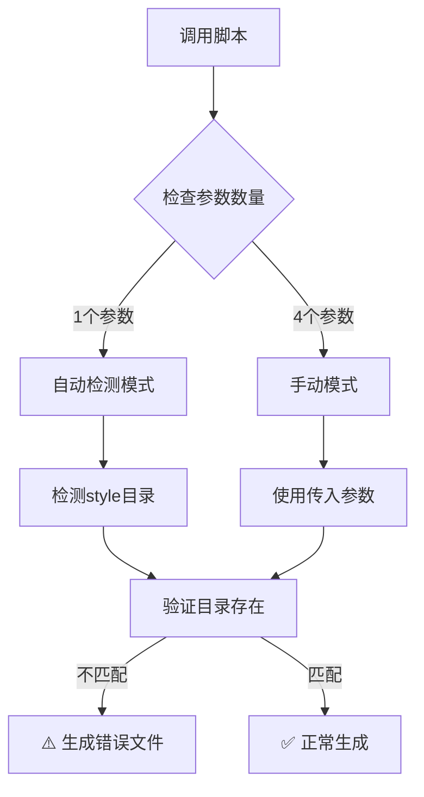

# UI原型实例化脚本分析报告

## 问题现象

在执行 `ui-instantiate-prototypes.sh` 脚本时，生成了 `style-4` 的原型文件（如 `login-style-4-layout-1.html`），但实际上 `style-consolidation` 目录下只有3个样式目录（style-1, style-2, style-3）。

## 调查结果

### 1. 目录结构验证

```bash
# 实际存在的样式目录
.workflow/.design/run-20251009-210559/style-consolidation/
├── style-1/
├── style-2/
└── style-3/

# 生成的原型文件包含
prototypes/login-style-4-layout-1.html  ❌ 引用不存在的 ../style-consolidation/style-4/tokens.css
prototypes/sidebar-style-4-layout-1.html  ❌ 引用不存在的 ../style-consolidation/style-4/tokens.css
```

### 2. consolidation-report.json 确认

```json
{
  "variant_count": 3,  // 明确显示只有3个变体
  "variants": [
    {"id": "style-1"},
    {"id": "style-2"},
    {"id": "style-3"}
  ]
}
```

### 3. PREVIEW.md 显示异常

```markdown
- **Style Variants:** 4  ⚠️ 与实际不符
- **Total Prototypes:** 24  (4 × 3 × 2 = 24)
```

### 4. 脚本auto_detect_style_variants()函数

```bash
# 位置：.claude/scripts/ui-instantiate-prototypes.sh 第52-71行
auto_detect_style_variants() {
    local base_path="$1"
    local style_dir="$base_path/../style-consolidation"

    # 统计style-*目录数量
    local count=$(find "$style_dir" -maxdepth 1 -type d -name "style-*" | wc -l)
    echo "$count"
}
```

**验证测试**：
```bash
cd .workflow/.design/run-20251009-210559/style-consolidation
find . -maxdepth 1 -type d -name "style-*" | wc -l
# 输出：3 ✅ 函数逻辑正确
```

## 根本原因分析

### ⚠️ 参数覆盖问题

脚本虽然有自动检测功能，但**允许手动参数覆盖**：

```bash
# 自动检测模式（正确）
ui-instantiate-prototypes.sh prototypes/  # 会自动检测到3个样式

# 手动模式（错误来源）
ui-instantiate-prototypes.sh prototypes/ "login,sidebar" 4 3  # 强制指定4个样式变体 ❌
```

### 🔍 实际调用场景

根据工作流命令 `.claude/commands/workflow/ui-design/generate.md` 第79-82行：

```bash
# Phase 1: Path Resolution & Context Loading
style_variants = --style-variants OR 3  # 默认为3
```

**推断的问题来源**：
1. 工作流命令被手动调用时，传入了 `--style-variants 4`
2. 这个参数被直接传递给 `ui-instantiate-prototypes.sh` 脚本
3. 脚本没有验证参数值与实际目录数量是否匹配
4. 导致生成了引用不存在的style-4目录的HTML文件

## 问题影响

### 生成的style-4文件问题

所有 `*-style-4-*.html` 文件都会出现CSS加载失败：

```html
<!-- 文件中的CSS引用 -->
<link rel="stylesheet" href="../style-consolidation/style-4/tokens.css">
<!-- ❌ 该路径不存在，导致样式无法加载 -->
```

### 影响范围

- `login-style-4-layout-{1,2,3}.html` - 3个文件 ❌
- `sidebar-style-4-layout-{1,2,3}.html` - 3个文件 ❌
- 对应的 `*-notes.md` 文件 - 6个说明文件（内容错误）

## 解决方案

### 方案1：重新生成（推荐）

```bash
cd .workflow/.design/run-20251009-210559/prototypes

# 删除错误的style-4文件
rm -f *-style-4-*

# 重新运行脚本（使用自动检测）
~/.claude/scripts/ui-instantiate-prototypes.sh . --session-id run-20251009-210559
```

### 方案2：脚本增强（预防）

在 `ui-instantiate-prototypes.sh` 中添加参数验证：

```bash
# 在第239行之后添加
# Validate STYLE_VARIANTS matches actual directories
actual_styles=$(find "$BASE_PATH/../style-consolidation" -maxdepth 1 -type d -name "style-*" | wc -l)
if [ "$STYLE_VARIANTS" -gt "$actual_styles" ]; then
    log_warning "Requested $STYLE_VARIANTS style variants, but only found $actual_styles directories"
    log_info "Auto-correcting to $actual_styles style variants"
    STYLE_VARIANTS=$actual_styles
fi
```

### 方案3：工作流命令修复

在 `.claude/commands/workflow/ui-design/generate.md` 中添加验证：

```bash
# Phase 1: Path Resolution & Context Loading (第79-82行之后)
style_variants = --style-variants OR 3  # Default to 3

# 添加验证逻辑
actual_styles = count_directories({base_path}/style-consolidation/style-*)
IF style_variants > actual_styles:
    WARN: "Requested {style_variants} styles, but only {actual_styles} exist"
    REPORT: "Auto-correcting to {actual_styles} style variants"
    style_variants = actual_styles

VALIDATE: 1 <= style_variants <= 5
```

## 预防措施

1. **优先使用自动检测**：
   ```bash
   # ✅ 推荐：让脚本自动检测
   ui-instantiate-prototypes.sh prototypes/

   # ⚠️ 谨慎：手动指定参数（需确保正确）
   ui-instantiate-prototypes.sh prototypes/ "login,sidebar" 3 3
   ```

2. **验证consolidation输出**：
   ```bash
   # 生成原型前，先确认样式数量
   jq '.variant_count' style-consolidation/consolidation-report.json
   ```

3. **使用工作流命令**：
   ```bash
   # 工作流命令会自动处理参数验证
   /workflow:ui-design:generate --base-path ".workflow/.design/run-xxx"
   ```

## 技术细节

### 自动检测逻辑流程



### find命令行为

```bash
# 正确的检测命令
find style-consolidation -maxdepth 1 -type d -name "style-*"
# 输出：
# style-consolidation/style-1
# style-consolidation/style-2
# style-consolidation/style-3

# wc -l 统计行数 = 3 ✅

# 注意：style-extraction 不会被匹配（它在父目录）
# find . -maxdepth 1 -type d -name "style-*"
# 只会在当前目录搜索，不会递归到子目录
```

## 总结

### 问题根源
✅ **确认**：脚本被手动调用时传入了错误的 `--style-variants 4` 参数，但实际只有3个样式目录存在。

### 脚本行为
✅ **确认**：`auto_detect_style_variants()` 函数逻辑正确，能够正确检测到3个样式目录。

### 修复优先级
1. 🔴 **立即**：删除错误的style-4文件，重新生成
2. 🟡 **短期**：在脚本中添加参数验证逻辑
3. 🟢 **长期**：在工作流命令中添加防护验证

### 最佳实践
- 优先使用脚本的自动检测模式
- 在手动指定参数前，先验证 `consolidation-report.json`
- 使用工作流命令而非直接调用脚本
